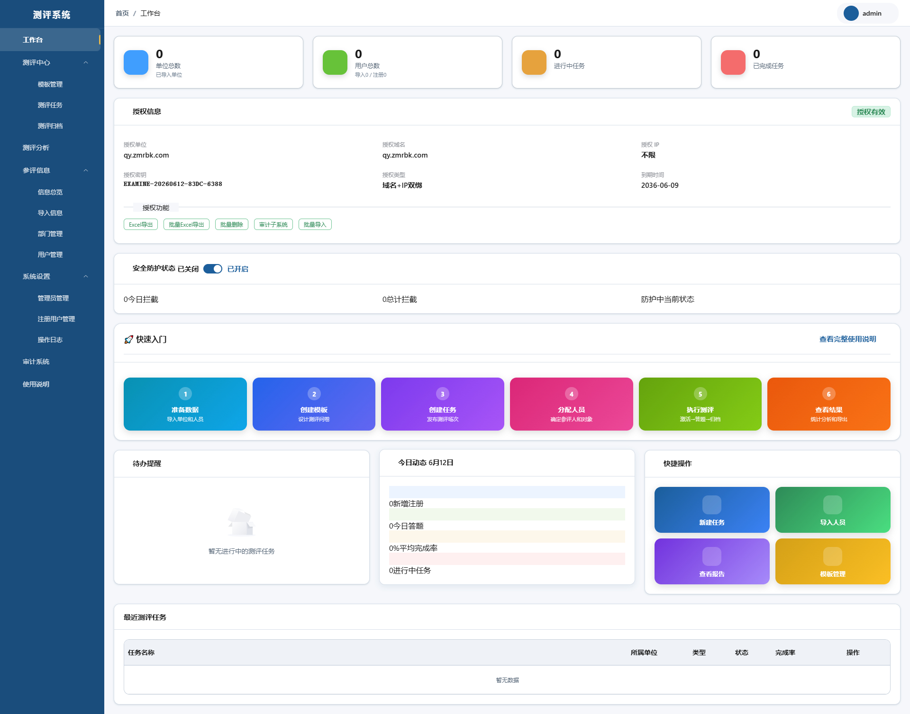
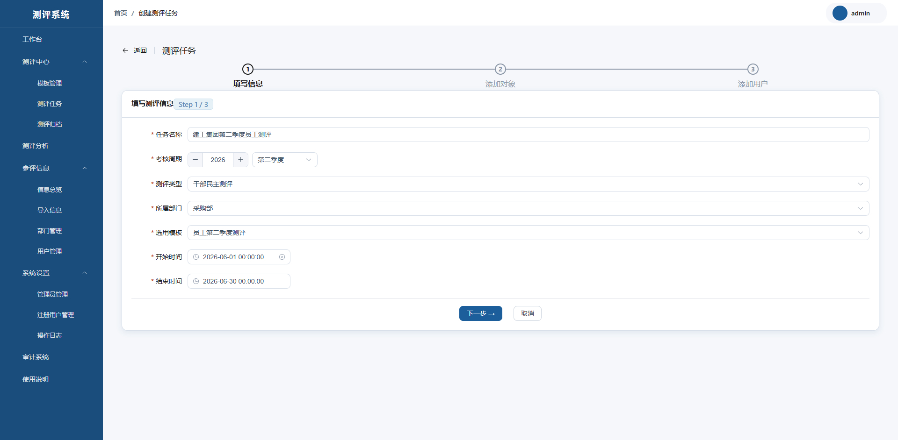
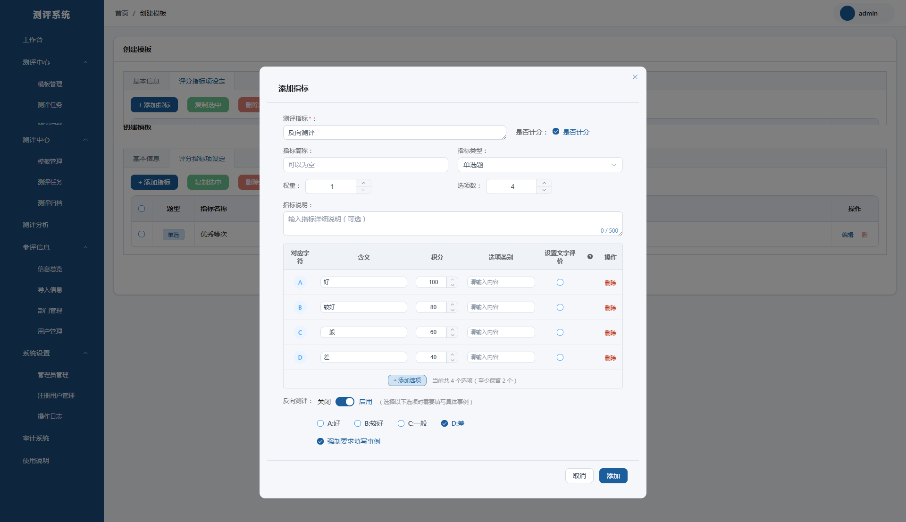
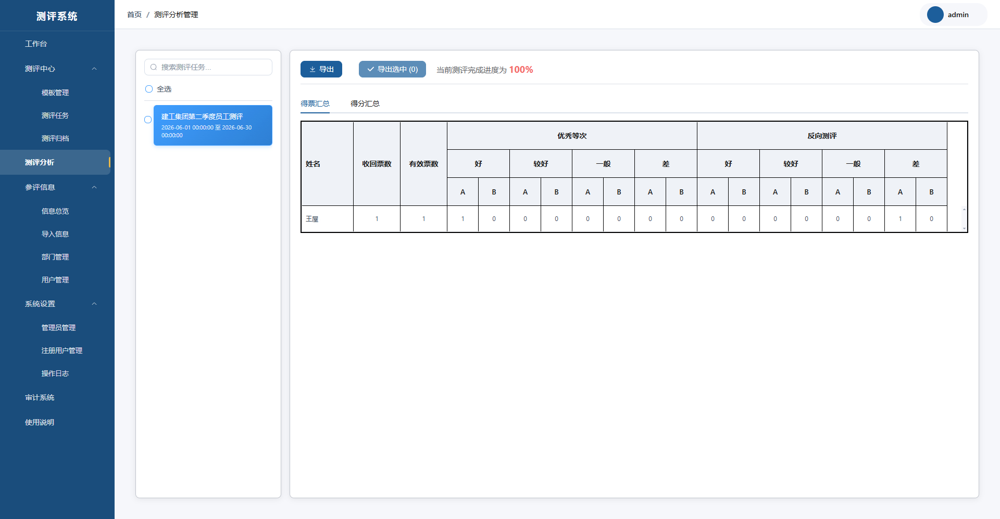
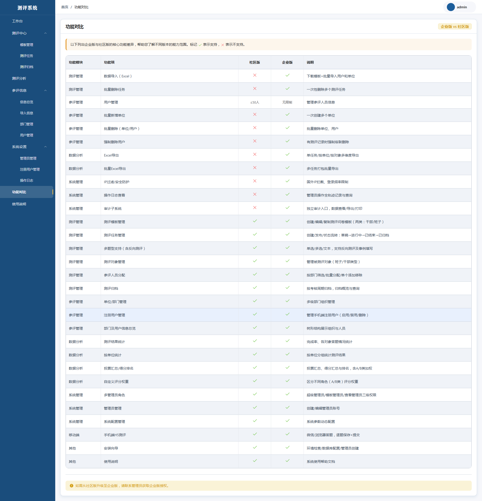
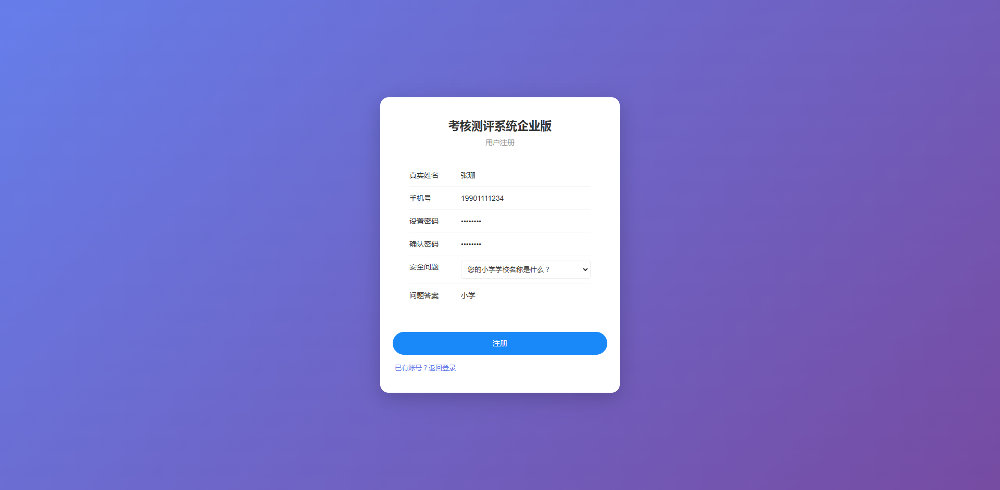
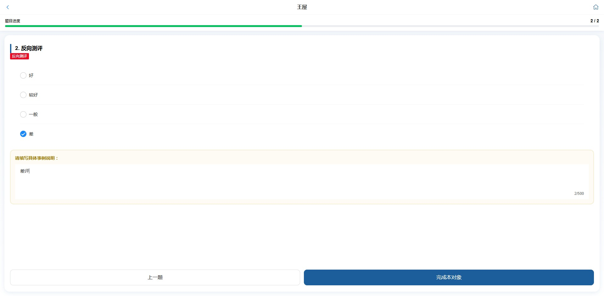
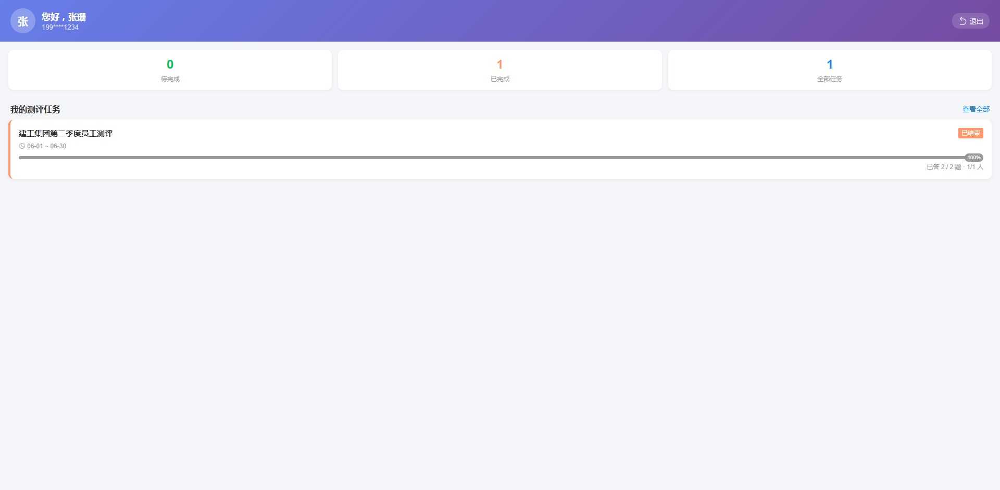

# Cadre and Department Assessment System (CepingSys)

> Enterprise-level assessment system supporting democratic evaluation, cadre assessment, department assessment and other scenarios.

**[中文说明](README.md)**

## Features

### 📊 Core Features
- ✅ **Assessment Management** - Create and manage assessment tasks
- ✅ **User Management** - User information management and permission configuration
- ✅ **Department Management** - Organizational structure management
- ✅ **Indicator Management** - Assessment indicator system configuration
- ✅ **Data Statistics** - Assessment result statistics and analysis
- ✅ **Mobile Support** - WeChat QR code login for assessment participation
- ✅ **Report Export** - Export assessment results

### 🏢 Application Scenarios
- Cadre assessment in party and government organs
- Performance assessment in enterprises and institutions
- Annual department assessment
- Democratic evaluation

## Online Demo

| Version | Frontend | Admin | Username/Password |
|---------|---------|-------|------------------|
| Community | [http://sq.zmrbk.com:2002](http://sq.zmrbk.com) | [http://sq.zmrbk.com:2001](http://sq.zmrbk.com:2001) | admin / admin123 |
| Enterprise | [http://qy.zmrbk.com:2002](http://qy.zmrbk.com) | [http://qy.zmrbk.com:2001](http://qy.zmrbk.com:2001) | admin / admin123 |

## Version Comparison

| Feature | Community Edition | Enterprise Edition |
|---------|------------------|-------------------|
| Basic Assessment | ✓ | ✓ |
| Batch Operations | ✗ | ✓ |
| Data Import/Export | ✗ | ✓ |
| Analysis Export | ✗ | ✓ |
| Audit System | ✗ | ✓ |
| User Limit | Within 50 | Unlimited |
| Technical Support | Community | Official |

**For Enterprise Edition purchase:**
- 💬 WeChat: dldxzmr
- 📦 QQ Group: 248529293
- 🌐 Website: [www.zmrbk.com](https://www.zmrbk.com)

## Project Screenshots

### Admin Dashboard






### User Portal




## Tech Stack

| Layer | Technology |
|-------|-----------|
| Frontend (Admin) | Vue 3 + Element Plus |
| Frontend (Mobile) | Vite + Vue 3 |
| Backend | PHP 8.1 + Slim 4 |
| Database | MySQL 5.7+ |
| Server | Nginx |

## Quick Start

### Requirements
- PHP 8.1+
- MySQL 5.7+
- Nginx / Apache

### Installation
1. Download source code and upload to server
2. Visit `http://your-domain/install.php`
3. Follow the installation wizard

## Project Structure

```
.
├── backend/          # Backend code
│   ├── src/          # Slim 4 application
│   ├── public/       # Entry files
│   └── vendor/       # Composer dependencies
├── frontend/         # Admin frontend
│   ├── src/          # Vue 3 components
│   └── dist/         # Build output
├── mobile/           # Mobile frontend
│   ├── src/          # Vue 3 components
│   └── dist/         # Build output
└── install.php       # Installation script
```

## Contributing

We welcome issues and suggestions! You can participate through:
- Submit bug reports or feature requests in GitHub Issues
- Join QQ group for discussion

## License

MIT License

## Contact

- 💬 WeChat: dldxzmr
- 📦 QQ Group: 248529293
- 🌐 Blog: [www.zmrbk.com](https://www.zmrbk.com)

---

*If this project helps you, please give it a Star ⭐!*